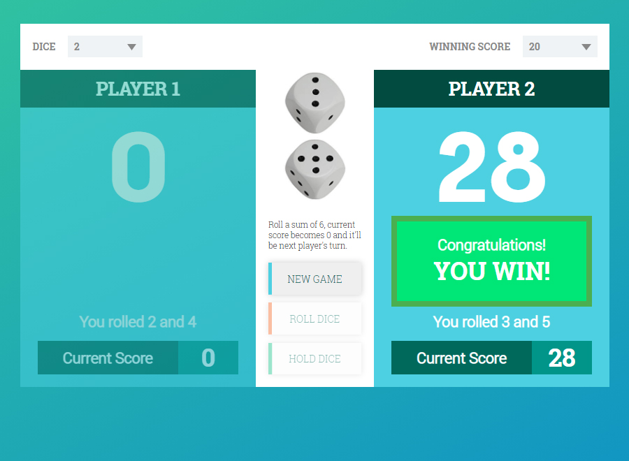

# Dice Game Vanilla JavaScript

This is a mini-project based on the [Pig Game](https://en.wikipedia.org/wiki/Pig_(dice_game)). I didn't intend to make this responsive in mobile devices, since the goal is to practice JavaScript objects, arrays and the functionalities of the game.

- You can select either 1 or 2 DICE to roll.
- You can set the WINNING SCORE from 20 up to 100.
- If you select 1 DICE you have to avoid a ROLL VALUE of 1, this will make your CURRENT SCORE to ZERO.
- If you select 2 DICE you have to avoid a total ROLL VALUE of 6, this will make your CURRENT SCORE to ZERO.
- Your CURRENT SCORE will increase as you roll the DICE but don't roll too many, do HOLD DICE so that your CURRENT SCORE will be added to MAIN SCORE.
- When you do HOLD DICE, the other player get's the chance to roll the DICE.
- A player WINS when the MAIN SCORE is equal to or greater than the WINNING SCORE set. 

 

Lite Site URL: [Live Demo](https://kenny-estrella-dice-game-vanilla-javascript.netlify.app/)

###  Used tools

### Used technologies
  